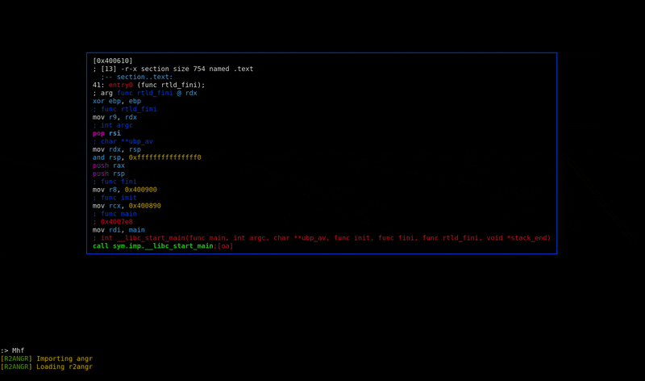

# Modality 

A **radare2** plugin to integrate the symbolic execution capabilities of **angr**. 

---

This project is mid-development so bugs and missing features are expected. The tool has partial gitbook [documentation](https://chasekanipe.gitbook.io/modality/) in addition to several introductory [video tutorials](https://www.youtube.com/playlist?list=PL5k2-CzbGSTRkCp7_L4RRudVaIVdKx3pT).

<br>

<p align="center">
  
</p>

---

## Installation
First install the python prerequisites

```
pip3 install angr termcolor
```

Then install r2lang

```
r2pm -i lang-python
```

Then install modality

```
r2pm -i modality
```

If you have installation issues feel free to create a git issue.

---

## Goals

This project intends to
 - Better integrate symbolic execution with the rest of the reverse engineering process
 - Provide a faster alternative to using angr than writing scripts
 - Provide useful visualizations of the angr backend
 - Allow for switching between concrete and symbolic execution (this feature is coming soon)
 - Include a suite of features for vulnerability detection, exploit generation, etc (coming soon)


---

*Contact me at chasekanipe [at] gmail [dot] com*
